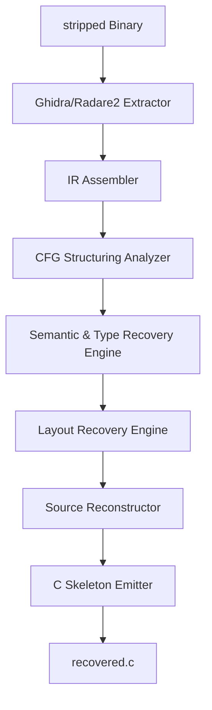

# Hephaestus System Architecture

Hephaestus is a conservative binary reconstruction framework targeting ARM64 binaries. It analyzes stripped binaries, recovers type constraints and control-flow structure, and generates syntax-safe recovered C code without inventing or guessing decompiler semantics.

## Component Block Diagram

## Core Modules

1. **Extraction (Phase 1)**: Interfaces with Ghidra and Radare2 via headless scripts to extract disassembly, functions, symbol tables, and basic block data.
2. **IR Assembly (Phase 2)**: Merges raw Ghidra and Radare2 metadata, normalizing architecture-specific attributes into a `unified_ir.json`.
3. **CFG Structuring (Phase 3)**: Performs loop and sequence analysis on function control flow graphs to structure them into acyclic or cyclic nodes.
4. **Semantic & Type Inference (Phase 4)**: Recover variables, ABI parameters, and return types, refining types iteratively via structural constraints.
5. **Conservative Layout Recovery (Phase 4C)**: Collects offset and size observations to group variables without inventing fabricated struct definitions.
6. **Source Reconstruction (Phase 5)**: Maps recovered semantics and structure into intermediate statements and emits a syntax-safe `recovered.c`.
